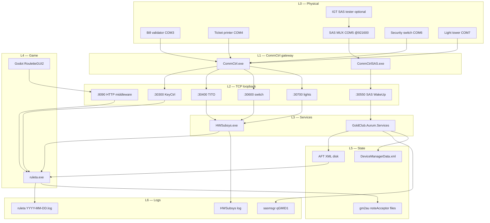
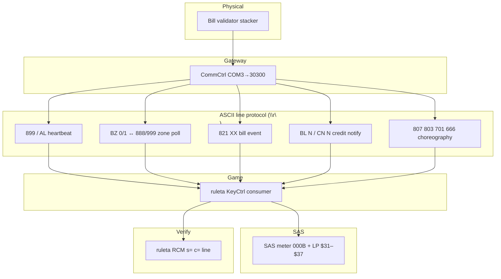
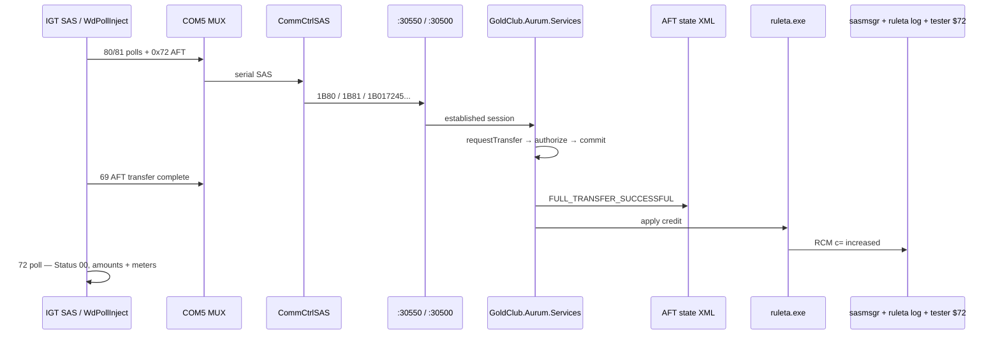
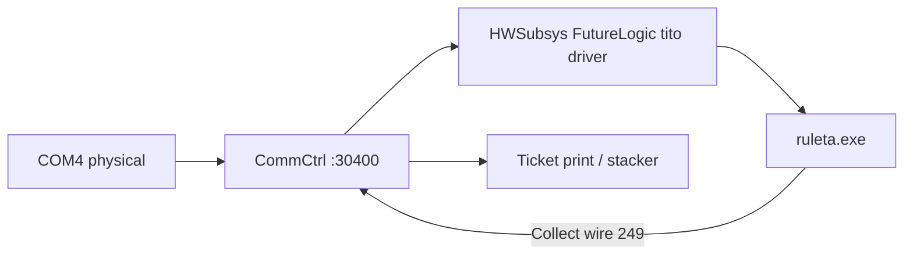
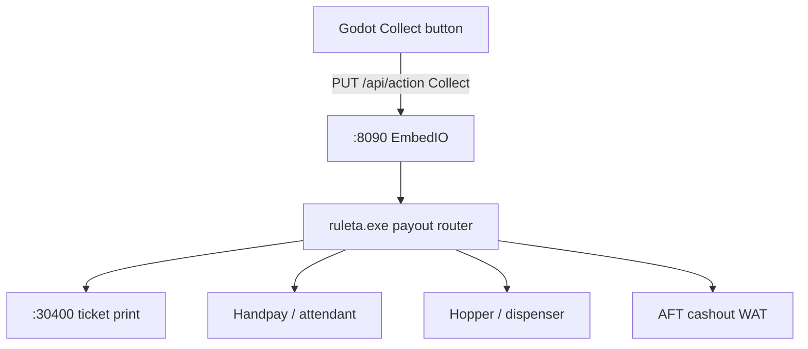

# IGT / host → ruleta.exe — layered cashflow (roulette)

Cabinet: **10.0.0.90** (`GCC_RT_330106_01` / GST20664).  
Slot equivalent: [`igt-onehand-layered-flow.clean.svg`](igt-onehand-layered-flow.clean.svg).

This file diagrams **all cash paths** on the roulette image. Each path uses the same
six-layer swimlane model as the slot AFT diagram.

---

## Master overview — parallel buses



---

## Path 1 — Bill in (physical cash)

**Proven on .90** (2026-07-27): two physical inserts + one synthetic inject.

| Run | Type | Signal after `999` | RCM delta |
|-----|------|-------------------|-----------|
| 12:07:45 | Physical | `821 27` → `BL 1`/`CN 1` | `c=` +200k (1.3M→1.5M) |
| 12:33:23 | Physical | `821 18` `821 19` `822 98` → `BL 10` | `c=` +200k (0→200k) |
| 14:01:43 | **Inject `captured`** | same burst as 12:33 (spliced) | `c=` +200k (0→200k) |

Session diagram: [`igt-ruleta-bill-flow-report.html`](igt-ruleta-bill-flow-report.html)



| Hop | Layer | Bytes / signal | Tool |
|-----|-------|----------------|------|
| 1 | Physical | Note accepted, escrow | — |
| 2 | COM3→30300 | `821 68`, `821 27`, … | WdSniff / Dallas capture |
| 3 | C2S ack | `BL 1\r\nCN 1\r\n` | capture log |
| 4 | ruleta | RCM credit increase | ruleta log |
| 5 | Aurum | Bill meter SAS poll response | sasmsgr / SAS verify |

Detail: [`../lab/roulette/BILL-ACCEPTOR-PROTOCOL.md`](../lab/roulette/BILL-ACCEPTOR-PROTOCOL.md)

Inject (proven):

```powershell
.\lab\roulette\Invoke-BillInjectRouletteRemote.ps1 -PayloadProfile captured -Credits 200000 -Send
```

---

## Path 2 — AFT cashless in (host transfer)

Same WAT2AFT engine as slot; **different TCP port** and **ruleta** as sink.



| Hop | Slot | Roulette |
|-----|------|----------|
| Bridge port | :31150 | **:30550** (WakeUpPort from ClientsSet.xml) |
| Config | COM11 | **COM5** MUX @921600 |
| Game sink | OneHand GM2AU | **ruleta** (no OneHand on this image) |
| Inject | `Invoke-WinDivertAft.ps1` | **`Invoke-WinDivertAftRoulette.ps1 -Send`** |

### Proven runs on `.90` roulette

| When | Method | Amount | ID / evidence |
|------|--------|--------|---------------|
| 2026-07-23 | WinDivert pollaft (no tester) | NonRestricted **100000** | Aurum txn **37**; sasmsgr `0172` |

---

## Path 3 — TITO voucher in / ticket out

Separate from bill bus. CommCtrl must listen on **30400 before HWSubsys** starts
(`Run-FullStack.ps1` ordering).



| Direction | Trigger | Port | Notes |
|-----------|---------|------|-------|
| Voucher **in** | Barcode scan / insert | :30400 | driverssetup `tito` index 0 |
| Ticket **out** | Godot `Collect` | :30400 + HTTP | wire code **249** = Collect TITO |
| Cashout alt | Collect variants | HTTP → ruleta | 241 hopper, 254 SAS handpay, 402 WAT |

Sniff: `Invoke-HwSniffRemote.ps1 -Ports 30400`

---

## Path 4 — Collect / cash out (software trigger)

No new physical device — Godot sends HTTP; ruleta picks payout channel.



| Collect wire code | Channel |
|-------------------|---------|
| 241 | Hopper |
| 249 | TITO |
| 252 | Bonus |
| 254 | SAS handpay |
| 282 | Remote |
| 285 | Dispenser |
| 402 | WAT |

Source: [`docs/action-endpoint-commands.md`](../../docs/action-endpoint-commands.md)

Sniff: `Invoke-RuletaGuiSniff.ps1` during Collect press.

---

## Path 5 — Dallas / KeyCtrl (admin + handpay clear)

Shares **:30300** with bill acceptor. Not a credit path by itself — unlocks handpay
and service menu.

```
Physical iButton / keyboard
  → COM3 → CommCtrl :30300
  → ruleta KeyCtrl
  → inject: 700\r\n 701\r\n <ROM>\r\n
  → log: KEY=admin DALLAS=<ROM> EVENT=IN|OUT
```

Tool: `Invoke-DallasSpliceRouletteRemote.ps1`  
Runbook: [`lab/DALLAS-INJECTION-RUNBOOK.md`](../../lab/DALLAS-INJECTION-RUNBOOK.md)

---

## Path 6 — Hardware auxiliary (non-cash but gates cash)

| Port | Device | Role in cashflow |
|------|--------|------------------|
| :30600 | Security switch | Door open → handpay lock |
| :30700 | Light tower | Attendant call / status |
| :25071 | HWSubsys hub | Aggregates HW sessions |

Sniff: `Invoke-HwSniffRemote.ps1 -Ports 30600,30700,25071`

---

## Path 7 — SAS meter readback (accounting oracle)

Read-only verification — no credit injection.

```
Aurum sasmsgr poll responses
  → SAS LP $31–$45 (bill in/out by denom)
  → meter 000B (total bill in)
  → DeviceManagerData notesInStackerAmt
  → GUI SAS verify / meter_comparator.py
```

---

## Slot vs roulette — one-page comparison

| Layer | Slot OneHand | Roulette ruleta |
|-------|--------------|-----------------|
| SAS serial | COM11 | COM5 MUX |
| SAS TCP | :31150 / :31100 | **:30550** / :30500 |
| Game EXE | OneHand.exe | ruleta.exe |
| GUI | Embedded in OneHand | Godot → :8090 |
| Dallas | :30800 | **:30300** (shared w/ bill) |
| Bill | (not diagrammed) | **:30300** |
| TITO | COM4 :30400 | COM4 :30400 |
| AFT inject script | `Send-TestAft1000.ps1` | `Invoke-WinDivertAftRoulette.ps1` |
| Primary log | SlotLog | `ruleta\` + sasmsgr |

---

## Related files

| File | Purpose |
|------|---------|
| [`igt-ruleta-bill-flow-report.html`](igt-ruleta-bill-flow-report.html) | **Bill flow HTML report** (2026-07-27) |
| [`igt-ruleta-visio-shapes.txt`](igt-ruleta-visio-shapes.txt) | Copy-paste Visio boxes (all paths) |
| [`lab/roulette/CASHFLOW-LAYERS.md`](../lab/roulette/CASHFLOW-LAYERS.md) | Operator hub + sniff cheat sheet |
| [`aft/hops/README.md`](../hops/README.md) | AFT hop decouple map (applies to path 2) |
| [`windivert-pollaft-inject-flow.md`](windivert-pollaft-inject-flow.md) | L0–L3 inject layers |
