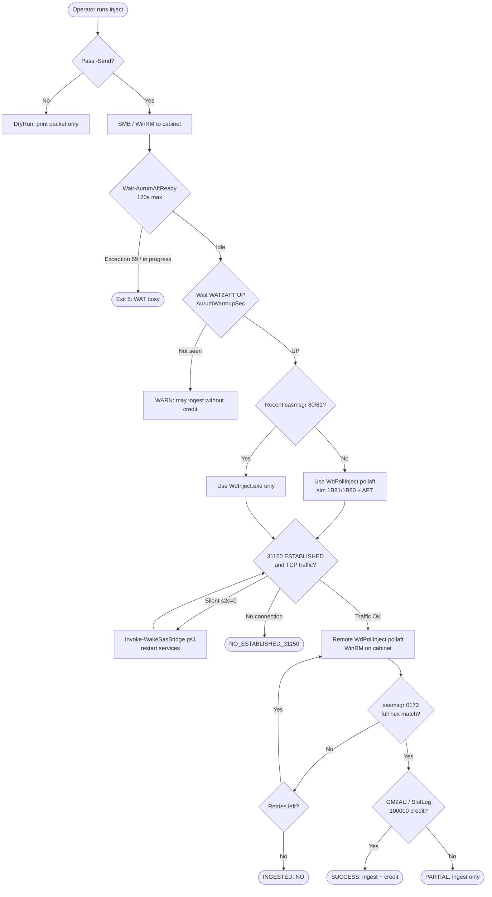
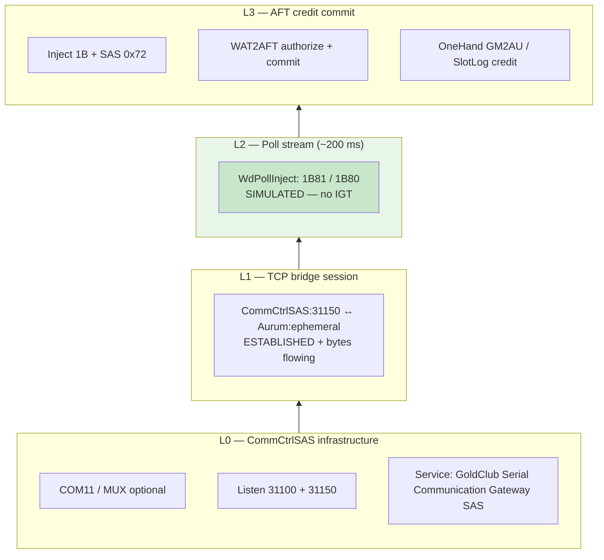
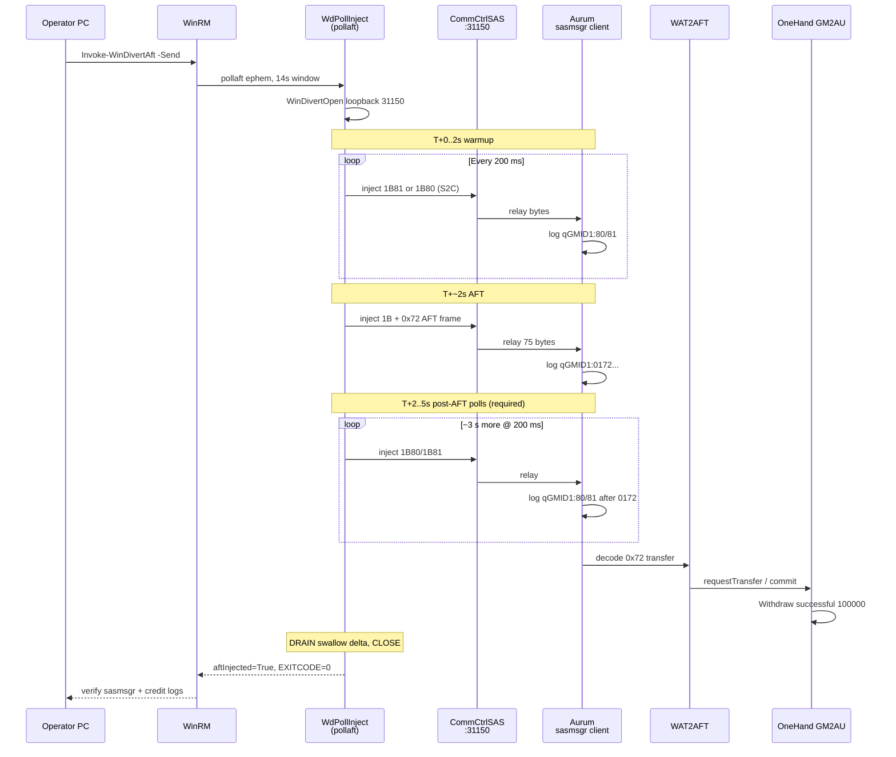
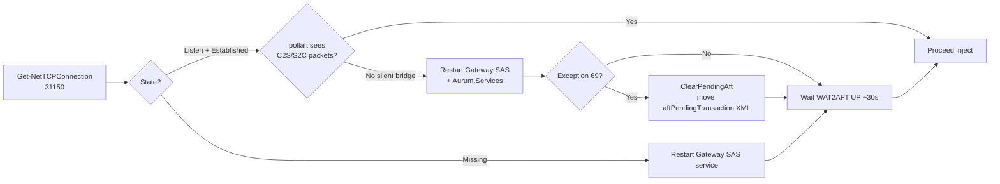
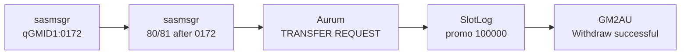

# WinDivert pollaft AFT inject — flow diagrams

Reference: [`PROVEN-INJECT-PROCEDURE.md`](../PROVEN-INJECT-PROCEDURE.md), [`no-physical-polls-layers.md`](../no-physical-polls-layers.md).

Cabinet **10.0.0.90** (GST20664), path **`-SasPollMode WinDivert`**, no physical IGT polls.

---

## 1. Orchestrator flow (`Invoke-WinDivertAft.ps1 -Send`)



---

## 2. Layer stack (what must be alive)



**WinDivert replaces L2 organic polls only.** L0+L1 must be real (service restart if wedged).

---

## 3. pollaft sequence (on cabinet, one inject attempt)



---

## 4. pollaft internal timeline

```mermaid
gantt
    title WdPollInject pollaft window (defaults)
    dateFormat X
    axisFormat %Ss

    section Polls
    C2S template learn     :a1, 0, 200ms
    Warmup 1B81/1B80       :a2, 200ms, 2000ms
    Post-AFT 1B80/1B81     :a3, 2000ms, 5000ms

    section AFT
    AFT_INJECTED 0x72      :milestone, 2000ms, 0ms

    section Drain
    DRAIN begin            :milestone, 5000ms, 0ms
    Swallow delta / close  :a4, 5000ms, 9000ms
```

---

## 5. Bridge wake decision



---

## 6. Success log chain



All five within ~500 ms of ingest when credit lands.