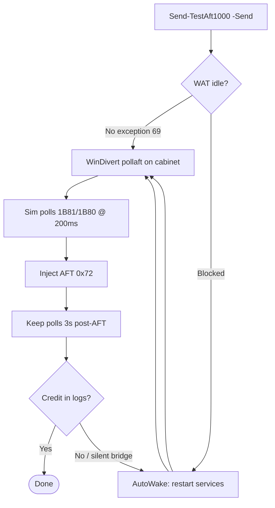

# Simple inject flow (one page)

Full detail: [windivert-pollaft-inject-flow.md](windivert-pollaft-inject-flow.md)

## Operator view — one command

```powershell
.\Send-TestAft1000.ps1 -Send
```

## What happens automatically



## Three layers (only L0 must be real)

| Layer | What | Simulated? |
|-------|------|------------|
| L0+L1 | CommCtrlSAS service + TCP 31150 | No — AutoWake restarts if wedged |
| L2 | 80/81 polls | Yes — WinDivert |
| L3 | AFT 0x72 + WAT credit | Yes — WinDivert pollaft |

No IGT tester. No manual wake step in normal use.